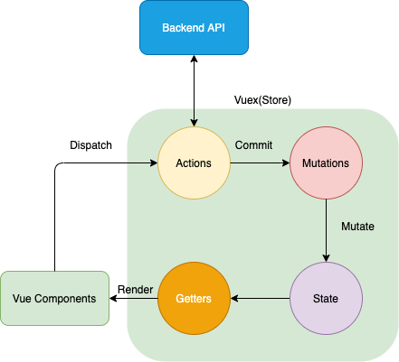
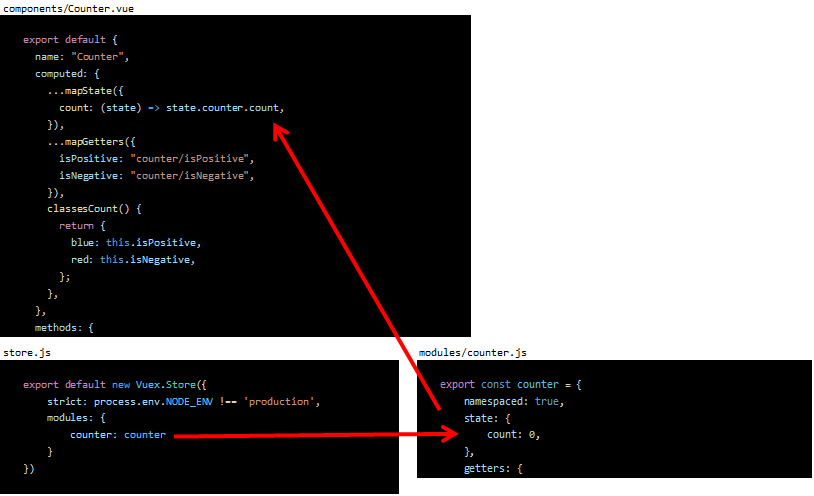
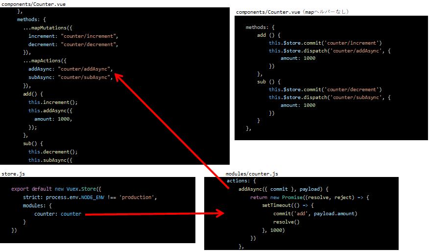
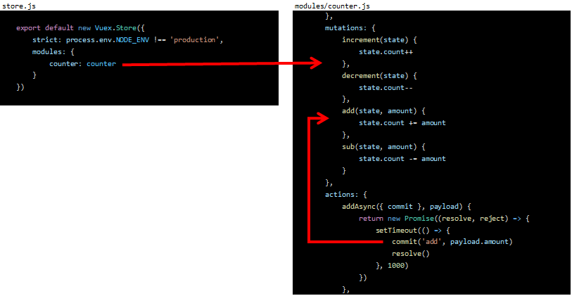
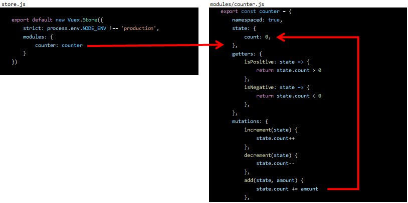
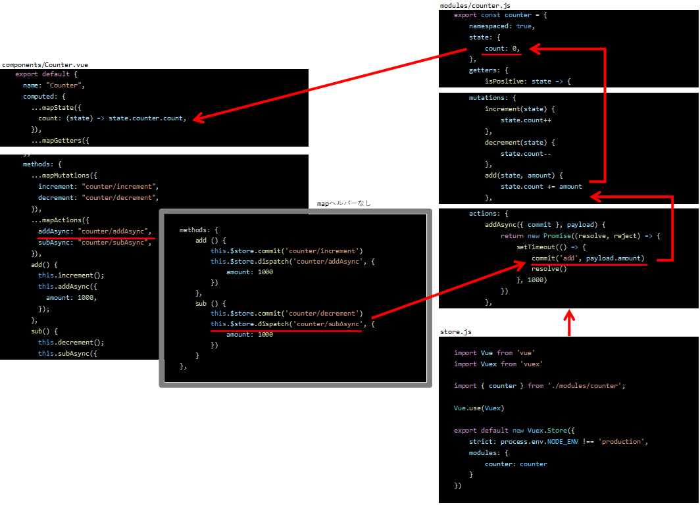

# explain.vuex.flow
Vuex の流れを理解する
]
## Project setup
```
yarn install
```

### Compiles and hot-reloads for development
```
yarn serve
```

## サンプルコード


### App.vue
```javascript
<template>
  <div id="app">
    <counter></counter>
  </div>
</template>

<script>
import Counter from "./components/Counter.vue";

export default {
  name: "app",
  components: {
    Counter,
  },
};
</script>
```

### components/Counter.vue
```javascript
<template>
  <div>
    <p :class="classesCount">{{ count }}</p>
    <button @click="sub">-</button>
    <button @click="add">+</button>
  </div>
</template>

<script>
import { mapState, mapGetters, mapMutations, mapActions } from "vuex";

export default {
  name: "Counter",
  computed: {
    ...mapState({
      count: (state) => state.counter.count,
    }),
    ...mapGetters({
      isPositive: "counter/isPositive",
      isNegative: "counter/isNegative",
    }),
    classesCount() {
      return {
        blue: this.isPositive,
        red: this.isNegative,
      };
    },
  },
  methods: {
    ...mapMutations({
      increment: "counter/increment",
      decrement: "counter/decrement",
    }),
    ...mapActions({
      addAsync: "counter/addAsync",
      subAsync: "counter/subAsync",
    }),
    add() {
      this.increment();
      this.addAsync({
        amount: 1000,
      });
    },
    sub() {
      this.decrement();
      this.subAsync({
        amount: 1000,
      });
    },
  },
};
</script>

<style scoped>
.red {
  color: red;
}
.blue {
  color: blue;
}
</style>
```

### modules/counter.js
```javascript
export const counter = {
    namespaced: true,
    state: {
        count: 0,
    },
    getters: {
        isPositive: state => {
            return state.count > 0
        },
        isNegative: state => {
            return state.count < 0
        },
    },
    mutations: {
        increment(state) {
            state.count++
        },
        decrement(state) {
            state.count--
        },
        add(state, amount) {
            state.count += amount
        },
        sub(state, amount) {
            state.count -= amount
        }
    },
    actions: {
        addAsync({ commit }, payload) {
            return new Promise((resolve, reject) => {
                setTimeout(() => {
                    commit('add', payload.amount)
                    resolve()
                }, 1000)
            })
        },
        subAsync({ commit }, payload) {
            return new Promise((resolve, reject) => {
                setTimeout(() => {
                    commit('sub', payload.amount)
                    resolve()
                }, 1000)
            })
        }
    }
}
```

### store.js
```javascript
import Vue from 'vue'
import Vuex from 'vuex'

import { counter } from './modules/counter';

Vue.use(Vuex)

export default new Vuex.Store({
    strict: process.env.NODE_ENV !== 'production',
    modules: {
        counter: counter
    }
})
```

## Vuex の全体図


## state を参照する
1. ストアの中に state を用意してコンポーネントの computed で参照する



## Actions を dispatch する
2. methods の中なりライフサイクルの中なりから、 **Actions** を **dispatch** する



## Mutations へ commitする
3. **Actions** の中から **Mutations** へ **Commit** する



## state を更新する
4. Mutation の中から state に新しい値を入れる



この 4 つで 1 サイクルが基本となる。

## まとめ


## なんで Actions と Mutations は別れているの？
Actions と Mutations が別れているのは、責務の分離のため。methods に書きたいロジックの中から共通化できそうな部分は Actions や mutation に移していくのがスマート。

API 通信などの非同期処理は必ず Actions で行う。

一方、Mutations は、Actions から payload を受け取って、そのまま state に格納する場合や、一定の加工を行って state に格納するのに Mutations を使うとよい。

Actions や Mutations は受け取った値をそのまま次のプロセスへ渡すこともあり、その場合にはただセッターが生えているような短いコードになる。

state に対して書き込みを行えるのは Mutations からのみとなる。
